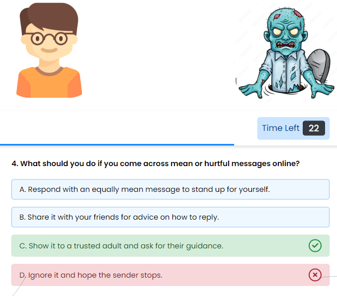

## Demo

Live Demo - Coming Soon...

## About

School Children Quiz App is a simple, fun and educational web-based quiz application designed to teach kids about internet safety, cyberbullying awareness, and responsible online behavior.

## Introduction

Welcome to the School Children Quiz App! This interactive quiz is designed to help kids learn important internet safety concepts while having fun. The quiz covers topics such as identifying spam emails, dealing with cyberbullying, protecting personal information online, and more.

## Features

- Engaging quiz format with multiple-choice questions.
- Questions focus on internet safety, cyberbullying, and responsible online behavior.
- Timer adds excitement and challenges players to think quickly.
- Randomized question order for replayability.
- Colorful and user-friendly interface suitable for kids.

## How to Play

1. Click the "Play Quiz" button to start the quiz.
2. Read the rules and instructions carefully.
3. Answer each question within the given time limit.
4. View your score and see how well you did at the end.

## Installation

1. Clone the repository: `git clone https://github.com/Psalm1st/Diff-2.git`
2. Open `index.html` in a web browser.

## Contribution

Contributions are welcome! If you find any issues or want to add new questions, feel free to create a pull request.

## Credits

- Samuel Chukwu + 3 other group members - Developer(s)
- HZ University of Applied Sciences
- Quiz questions adapted from random source of knowledge

